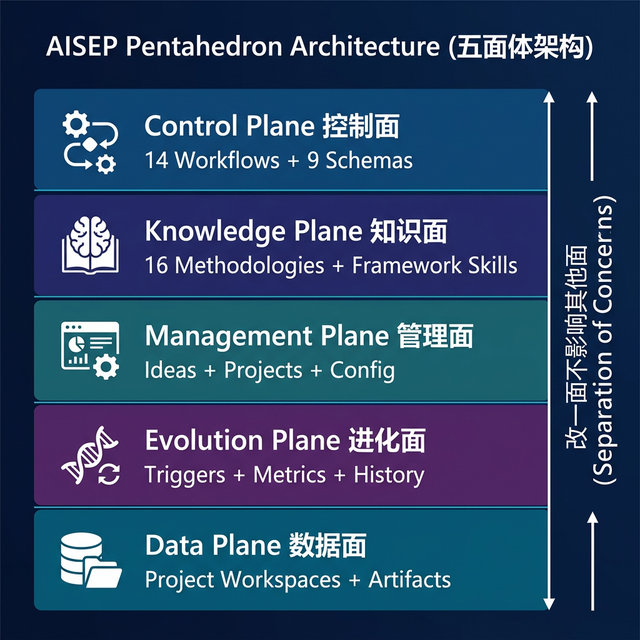
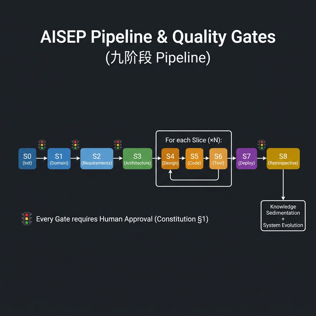
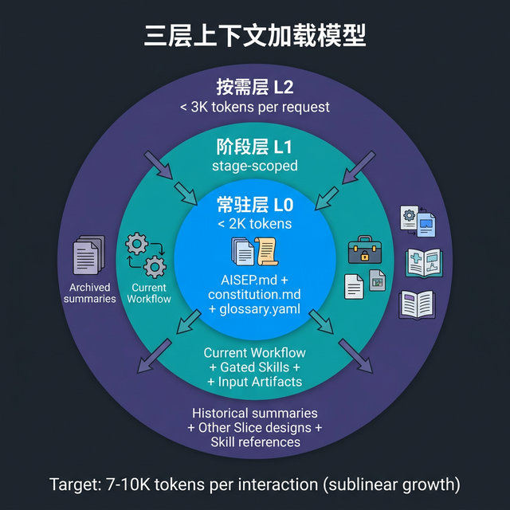
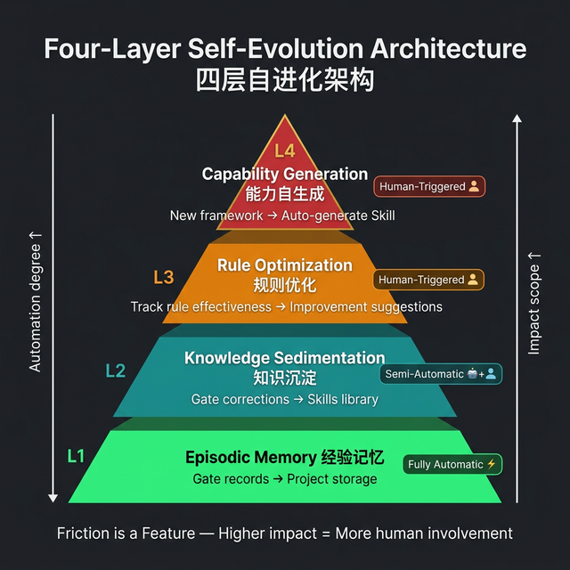

# AISEP: AI-Integrated Software Engineering Process

**一种约束驱动的 AI-人类协作软件工程系统**

> **Version 0.1** · 2026-03-13
>
> 摘要：本文提出 AISEP（AI-Integrated Software Engineering Process），一种将结构化工程约束与大语言模型（LLM）能力深度融合的软件工程系统。AISEP 通过**五面体架构**（控制面/知识面/管理面/进化面/数据面）组织 181 个系统文件，实施 **8 大上下文机制**控制 AI 的认知边界，并内置**四层自进化架构**使系统越用越好。在一个制造业 ERP 项目的全生命周期验证（S0→S8，7 个垂直切片、12 个质量门禁全部通过）中，AISEP 展现了 AI 在约束框架内进行高质量软件交付的可行性。

---

## 1. 引言

### 1.1 问题背景

大语言模型（LLM）在代码生成领域取得了突破性进展。GitHub Copilot、Cursor 等工具极大提升了单文件级别的编码效率。然而，**软件工程 ≠ 编码**——从需求分析到系统部署，一个完整的软件项目涉及领域建模、架构设计、质量保障、部署运维等多个维度的专业决策。

当前 AI 辅助编程面临三大核心挑战：

| 挑战 | 表现 | 根因 |
|------|------|------|
| **上下文失控** | 项目增长后 AI "遗忘"早期架构决策 | LLM 上下文窗口有限，缺乏结构化记忆管理 |
| **质量不可控** | 生成的代码不符合框架惯例，踩已知陷阱 | 缺乏领域知识的系统化注入机制 |
| **经验不可积累** | 每个项目从零开始，相同错误反复出现 | 无跨项目的学习和进化闭环 |

这三个挑战的共同本质是：**缺少一个连接 AI 能力与工程约束的中间层。**

### 1.2 设计哲学

AISEP 的核心思想可以浓缩为一句话：

> **给 AI 约束，而非指令。让 AI 在约束内自由探索，人类控制边界。**

这一理念的形式化表达为 **"约束下的探索"（Constrained Exploration）**：

```
每个阶段 = 输入约束 → 输出 Schema → Quality Gate → 人工决策点
```

AI 不是被"告诉做什么"，而是被"告诉边界在哪"。这让 AI 保持创造性的同时确保工程可控。

### 1.3 与相关工作的定位

| 项目 | 定位 | AISEP 的区别 |
|------|------|-------------|
| **OpenSpec** | 规格驱动的制品生成 | AISEP 管理完整生命周期（S0→S8），不仅是规格 |
| **SpecKit** | 规格+研究模板 | AISEP 内置方法论层和自进化，不仅是模板 |
| **OpenClaw** | AI Agent 自生成代码 | AISEP 强调人在回路（HiL），AI 不可自行决策 |
| **MiClaw** | 运行中自动创建能力模块 | AISEP 的 L4 自生成需经人审批 |
| **AlphaEvolve** | 代码自优化 | AISEP 借鉴其进化思想到规则优化层（L3） |

**AISEP 的独特定位**：不是又一个 AI 编码工具，而是一个**完整的 AI-人类协作工程系统**——覆盖从想法到部署的全生命周期，并内置持续自进化能力。

---

## 2. 系统架构

### 2.1 五面体分层设计

AISEP 采用五面体（Pentahedron）架构，每个面（Plane）负责一个正交关注点，遵循**关注点分离（Separation of Concerns）**原则：



**设计原则**：改一个面不影响其他面。例如：

- 更换技术栈（通过知识面的框架 Skill），不需要改控制面的 Workflow
- 添加新的 Pipeline 阶段（控制面），不影响现有项目数据（数据面）
- 新增进化触发条件（进化面），不影响方法论定义（知识面）

### 2.2 三文件入口设计

借鉴 OpenClaw 的 AGENTS/SOUL/TOOLS 三文件模式，AISEP 定义了三个顶层入口文件：

| 文件 | 灵感来源 | 职责 | 加载时机 |
|------|---------|------|----------|
| `AISEP.md` | AGENTS.md | 系统导航 + 当前项目 + 上下文围栏 | 始终加载（L0） |
| `constitution.md` | SOUL.md | 全局铁律：12 条不可违反的约束 | 始终加载（L0） |
| `capabilities.md` | TOOLS.md | 当前可用命令 + 已加载 Skills | 动态生成 |

**创新点**：`capabilities.md` 不是静态文件——由系统在每次交互前根据当前阶段、已加载 Skills 和 Token 预算动态生成，实现了**上下文感知的 AI 自我描述**。

### 2.3 九阶段 Pipeline 与质量门禁



**关键设计决策**：

1. **S0→S2 框架无关**：前三个阶段产出与技术栈无关的纯业务制品（领域模型、用户故事），意味着同一份 S0-S2 产出可以映射到不同技术栈（如 Odoo → FastAPI 切换）
2. **S3 全局一次、S4-S6 按 Slice 循环**：数据模型需要全局一致性，但实现可以渐进交付
3. **S8 复盘进化**：项目结束后自动触发经验提取和知识沉淀，形成进化闭环
4. **每个 Gate 必须经人确认**：这是 `constitution.md` 的第 1 条铁律，不可降级

### 2.4 垂直切片（Vertical Slice）策略

AISEP 在 S2 阶段引入**垂直切片规划**，将功能按业务场景纵切为可独立交付的单元。每个 Slice 满足：

- 安装后用户能完成一个有意义的业务操作
- 包含 1~3 个模型 + 完整视图 + 安全规则 + 测试
- 总代码量 300~800 行
- AI 能在一次交互中高质量完成
- 用户能在 5~10 分钟内审查完毕

这一策略通过 **Walking Skeleton 模式**实现：第一个 Slice 完成后即可安装运行，后续 Slice 增量追加，每次交付都是"可演示的"。

---

## 3. 上下文工程（Context Engineering）

### 3.1 核心理念

> **Context Engineering ≠ Prompt Engineering。** Prompt Engineering 关注"怎么措辞"，Context Engineering 关注"给 AI 看什么"。

AISEP 管理的是一个随项目增长而膨胀的结构化知识库。到 S6 第 4 个 Slice 时，若不显式控制加载策略，上下文将不可管理。AISEP 定义了 **8 大上下文控制机制**，确保 AI 在任何阶段都能获得精准的、token 效率最优的上下文。

### 3.2 三层上下文加载模型



> 总预算目标：常态 < 10K tokens，峰值 < 15K tokens

**核心观察**：由于 Compaction + Stage-Scoped Loading，**上下文预算不会随项目增大而线性增长**。只有 L2 的"可选加载量"会增加，但单次交互的 Token 消耗保持在 7~10K tokens 范围。

### 3.3 八大上下文机制

| # | 机制名称 | 要解决的问题 | 实现方式 |
|---|---------|-------------|---------|
| 1 | **Workflow 上下文声明** | 每个阶段需要什么上下文？ | Workflow frontmatter 中显式声明 `always` / `load_summary` / `exclude` |
| 2 | **制品自动摘要化（Compaction）** | 已通过 Gate 的制品如何压缩？ | Gate 通过 → 自动生成 `.summary.yaml`（8KB→0.8KB） |
| 3 | **Gate-log 滑动窗口** | 历史记录如何避免无限膨胀？ | 最近 5 条完整 + 更早的仅统计摘要 |
| 4 | **渐进披露与懒加载** | Skills/制品如何避免一次性全量加载？ | 三层渐进：L1 元数据（30 tokens）→ L2 完整 Skill→ L3 参考文档 |
| 5 | **capabilities.md 动态生成** | AI 如何知道自己当前能做什么？ | 根据当前阶段/已加载 Skills/Token 预算动态生成 |
| 6 | **会话审计与交接** | 跨对话如何保持连续性？ | `/tidy` 生成 `_context_audit.yaml` + `_next_session.yaml` |
| 7 | **上下文围栏（Context Fence）** | 多项目时如何防止上下文污染？ | `AISEP.md` 中声明 `excluded_dirs`（硬排除）+ 白名单例外 |
| 8 | **阶段/Slice 过渡归档** | 已完成上下文何时压缩、如何回溯？ | Compaction 的编排层：定义 WHEN/WHAT 触发，与机制 2 协作 |

**机制间的协作关系**：

```
机制 2（Compaction）  → 定义 HOW（怎么压缩）
机制 8（过渡归档）    → 定义 WHEN/WHAT（什么时候、压缩谁）
机制 3（gate-log 窗口）→ 定义 HOW MUCH（保留多少历史）
机制 7（Context Fence）→ 定义 WHERE NOT（排除哪些项目）
```

### 3.4 记忆引擎抽象 (Memory Engine)

为解决大语言模型的"上下文遗忘"（冯·诺依曼瓶颈），AISEP 将上述上下文机制映射为类似认知心理学的**短、中、长期记忆模型**：

| 记忆层面 | 载体形态 | 存活周期 | 核心职责 |
|---------|----------|---------|---------|
| **短期记忆** (STM) | 当前 Workflow、活跃切片制品、激活的 Skills (L1) | 单一 Pipeline 阶段 | 维系当前聚焦目标，由 Gating 控制，过 Gate 后硬刷新。 |
| **中期记忆** (MTM) | `_context_audit`、`_next_session`、近代 `gate-log` | 贯穿项目开发周期 | 压缩存储近期轨迹，维持跨会话 (Cross-session) 流水交接。 |
| **长期记忆** (LTM) | `constitution` (L0)、自进化知识库 (Skills)、制品摘要 | 永久 (跨项目积累) | 保存价值观铁律、最佳实践及通过复盘提纯的经验。 |

AISEP 的"执行者"不是持久进程，而是每次对话中的独立 AI 实例。系统的记忆通过 L0→L1→L2 协议，分布式地保存在结构化文件制品中，实现低 Token 消耗下的无限长程演进。

---

## 4. 知识注入体系

### 4.1 四层知识模型

AISEP 的知识注入从"怎么思考"到"怎么验证"分为四个递进层次：

```
┌─────────────────────────────────────────────┐
│ Layer 1: 方法论（Methodology）               │
│ "怎么思考" — DDD, INVEST, C4, SOLID...      │
├─────────────────────────────────────────────┤
│ Layer 2: 规范（Convention）                  │
│ "什么规则" — 命名标准、编码规范、安全策略     │
├─────────────────────────────────────────────┤
│ Layer 3: 模板（Template）                    │
│ "什么格式" — 制品模板（框架无关）+ 代码模板   │
├─────────────────────────────────────────────┤
│ Layer 4: Schema（Validation）               │
│ "什么结构" — YAML Schema 验证制品正确性      │
└─────────────────────────────────────────────┘

抽象度递减 ↓  约束力递增 ↓
```

方法论最灵活（可替换），Schema 最严格（必须通过）。

### 4.2 Skills 机制与 Gating

AISEP 将方法论和框架知识统一建模为 **Skills**（对齐 AI 编码助手的 Skills 机制），并通过 **Gating 条件**实现按需加载：

```yaml
# 方法论 Skill 的 frontmatter（以 DDD 为例）
---
name: ddd
description: "Domain-Driven Design — 领域驱动设计"
requires:
  stage: [s1, s3, s4]       # 仅在这些阶段激活
always: false
---
```

```yaml
# 框架 Skill 的 frontmatter（以 Odoo 17 为例）
---
name: odoo17
description: "Odoo 17 框架知识库"
requires:
  stage: [s3, s4, s5, s6, s7]
  tech_stack: "odoo17"        # 仅在技术栈匹配时加载
---
```

**Gating 的效果**：S1 阶段不会加载 Odoo 框架知识（因为此时尚未决定技术栈），S5 阶段不会加载 DDD 方法论（因为领域分析已完成）。这避免了不相关知识浪费宝贵的上下文预算。

### 4.3 Skills 三层优先级

借鉴 OpenClaw 的 Bundled/Managed/Workspace 三层模式：

```
╒═════════════════════════════════════════════════════════╕
│  Layer 3（最高优先级）: 项目级 Skills                    │
│  .agents/skills/  — 可覆盖同名 Skill                    │
├─────────────────────────────────────────────────────────┤
│  Layer 2（中等优先级）: 全局级 Skills                    │
│  ~/.aisep/skills/ — 跨项目共享，自进化沉淀目标           │
├─────────────────────────────────────────────────────────┤
│  Layer 1（最低优先级）: 内置 Skills                      │
│  AISEP 默认方法论（随系统分发）                          │
╘═════════════════════════════════════════════════════════╛
```

**解析规则**：同名 Skill 冲突时，项目层 > 全局层 > 内置层（就近原则）。列表字段可叠加，文本字段以高优先级层为准。

### 4.4 方法论 × 阶段映射

AISEP 在 S1-S7 的每个阶段绑定了经过验证的方法论组合（共 16 个方法论 Skill），形成 **S1-S2 三层需求控制模型**：

| 层 | 职责 | 方法论 |
|----|------|--------|
| Layer 1 | 领域驱动发现（S1） | DDD + Business Blueprint |
| Layer 2 | 结构化需求编写（S2） | User Story Mapping + INVEST + Given/When/Then |
| Layer 3 | 完整性验证（S2 Gate） | CRUD Matrix + Process Coverage |

---

## 5. 四层自进化架构

### 5.1 设计理念

AISEP 不是静态工具——每个项目的 Gate 修正、每次人工反馈都是提升系统质量的原材料。关键区别在于**人在回路（Human-in-the-Loop）**：系统管理的是工程流程和质量标准，错误的自改会影响所有后续项目，因此进化必须经人审批。

核心设计原则：**摩擦即特性（Friction is a Feature）**——越重要的变更，人工参与度越高。

### 5.2 四层架构



### 5.3 分层审批安全模型

| 层级 | 变更对象 | AI 能做 | 审批方式 |
|------|---------|---------|---------|
| **参数层** | 触发阈值、计算参数 | 建议 + 自动写入 | 用户口头确认 |
| **策略层** | Checklist、Convention、Skill | 建议 | 用户逐条确认 → 自动写入 |
| **铁律层** | constitution.md | 仅建议 | 用户**手动编辑文件**（不可自动写入） |

**铁律层要求手动编辑，是刻意引入的摩擦**——迫使充分思考，防止轻率批准。

### 5.4 知识沉淀双路径

```
路径 A: 修正模式沉淀（被动式）         路径 B: 知识条目晋升（主动式）
──────────────────                    ──────────────────
多项目 gate-log 发现相同修正模式        S8 复盘产出 knowledge entry
  ↓ 触发条件匹配                       ↓ 评估 readiness 等级
自动生成 Skill 补丁建议                 达到 L2-ready（3+ 项目验证）
  ↓ 人确认                              ↓ 人确认
写入 ~/.aisep/skills/（全局层）         生成 Skill 到全局层
```

### 5.5 规则生命周期

规则不应只增不减。AISEP 定义了五阶段生命周期：

```
draft → trial → active → deprecated → archived
 提出    试行    正式      弱化       归档
```

- **draft → trial**：用户确认 AI 建议
- **trial → active**：经过 ≥ 3 个 Gate 且无负面反馈
- **active → deprecated**：连续 6 个月未触发，或环境变化使其失效
- **deprecated → archived**：用户确认归档

---

## 6. 人在回路（Human-in-the-Loop）治理模型

### 6.1 Constitution：12 条不可违反的铁律

AISEP 的 `constitution.md` 定义了系统的绝对边界，分为四个维度：

| 维度 | 代表性条款 | 设计意图 |
|------|-----------|---------|
| **人在回路** | 所有 Gate 必须经人确认；AI 不可自行跳过阶段 | 确保人类始终掌握决策权 |
| **安全红线** | 禁止删除生产数据；禁止硬编码敏感信息 | 防止 AI 产生不可逆危害 |
| **知识诚实** | AI 必须标注不确定性；禁止编造 API | 建立可信赖的 AI 行为 |
| **自进化安全** | L1 记录自动执行；L2-L4 变更必须经人审批 | 防止进化失控 |

**项目级 Constitution 继承机制**：每个项目的 `constitution.md` 继承全局铁律并可添加更严格的约束（如"本项目禁止裸 SQL"），但**不可削弱**全局铁律的任何条款。

### 6.2 Greenfield 与 Brownfield 双路径

AISEP 同时支持新项目（Greenfield）和现有系统接管（Brownfield）两种路径：

| 维度 | Greenfield（正向构建） | Brownfield（逆向接管） |
|------|---------------------|---------------------|
| 入口 | `/idea promote` → S0 | `/onboard --source <path>` |
| 制品目录 | `artifacts/slices/` | `artifacts/changes/` |
| 增量单位 | Slice（业务功能切片） | Change（变更提案） |
| 额外步骤 | 无 | 逆向扫描 + 准确度标注 + 影响分析 |
| S4-S6 执行逻辑 | 完全复用 | 完全复用 |

**Brownfield 路径的创新**：逆向接管后的每次变更通过 `proposal.yaml` 进行影响分析（Greenfield Slice 不需要），确保对现有系统的修改在可控范围内。

---

## 7. 案例验证：制造业 ERP（proj-001）

### 7.1 项目概况

| 维度 | 数据 |
|------|------|
| **项目** | 面向中小型制造企业的一体化 ERP |
| **技术栈** | Odoo 17 + PostgreSQL 16 + Docker |
| **覆盖模块** | 销售 · 库存 · 采购 · 生产制造 |
| **开发模式** | AI 辅助开发（team_size = 0，无人工开发团队） |
| **Pipeline** | S0→S8 全生命周期走完 |

### 7.2 Pipeline 执行数据

| 阶段 | 产出 | Gate 结果 | 耗时 |
|------|------|----------|------|
| S0 初始化 | `project.yaml` | ✅ 6/6 passed, 1 warning | ~24min |
| S1 领域分析 | 领域模型（4 上下文, 10 聚合根）+ 能力图谱 + 24 项术语 | ✅ 9/9 passed | ~68min |
| S2 需求规格 | 40 个用户故事（INVEST 100% pass）+ 7 个 Slice | ✅ 12/12 passed | ~103min |
| S3 架构设计 | 4 模块, 12 模型, 安全模型 + 2 个 ADR | ✅ 14/14 passed | ~16min |
| S4-S6 ×7 | 7 个 Slice 全部交付 | ✅ 76/76 passed | ~199min |
| S8 复盘 | 回顾报告 + 3 条认知笔记 + 知识沉淀 | ✅ 6/6 passed | ~22min |
| **合计** | **12 个 Gate，123 项检查** | **全部通过，0 失败** | **~7h** |

### 7.3 垂直切片交付记录

| Slice | 业务范围 | 模块 | 亮点 |
|-------|---------|------|------|
| SLICE-01 | 销售基础流程 | sale_mfg | Walking Skeleton，标准复用 ~90% |
| SLICE-02 | 库存基础+出入库 | stock_mfg | 零自定义代码，纯 ACL+菜单配置 |
| SLICE-03 | 采购全流程 | purchase_mfg | 与 SLICE-01 对称设计 |
| SLICE-04 | BOM+生产计划 | mrp_mfg | BOM 生命周期状态机 |
| SLICE-05 | 生产执行与报工 | mrp_mfg | 领料→报工→入库完整闭环；修复 Odoo 17 字段兼容性 |
| SLICE-06 | MRP建议向导 | mrp_mfg | TransientModel 向导模式 |
| SLICE-07 | 快捷入口+高级功能 | stock_mfg | 全部利用标准功能 |

### 7.4 自进化产出

项目完成后的 S8 复盘产生了实际的知识沉淀：

| 沉淀内容 | 类型 | 知识条目 |
|---------|------|---------|
| TransientModel 向导模式 | 框架模式 | learn-006 |
| Odoo 17 字段兼容性陷阱（`quantity_done → quantity`） | 框架陷阱 | learn-007 |
| Vertical Slice 架构实战验证 | 架构方法论 | learn-008 |

这些知识条目进入 readiness 评估流程，未来经过更多项目验证后将晋升为全局 Skill。

### 7.5 关键架构决策（ADR）

| ADR | 决策 | 理由 |
|-----|------|------|
| ADR-001 | Odoo 17 + PostgreSQL 16 | 17 的 MRP/BOM 模块 API 更稳定 |
| ADR-002 | 全标准继承扩展（零原生修改） | 确保可升级性和维护性 |

---

## 8. 系统量化指标

### 8.1 文件组成

| 类别 | 文件数 | 代表性内容 |
|------|--------|-----------|
| **控制面** | 14 Workflows + 9 Schemas | Pipeline/S0-S8/Tidy/Onboard |
| **知识面** | 16 方法论 Skills + 6 框架知识文件 | DDD/INVEST/C4/SOLID/Odoo17 |
| **管理面** | 5 配置/状态文件 | config/ideas/registry |
| **进化面** | 4 进化数据文件 | triggers/rule-metrics/corrections-log/history |
| **数据面** | 项目制品（动态增长） | proj-001: 12 文件 + slices/ + addons/ |
| **文档** | 11 份设计文档 | ~110KB 设计知识 |
| **总计** | **~181 文件** | |

### 8.2 上下文效率

| 指标 | 数据 |
|------|------|
| 单次交互 Token 消耗 | 7-10K tokens（常态） |
| 上下文压缩比 | 10:1（8KB 制品 → 0.8KB 摘要） |
| 上下文增长率 | 亚线性（不随项目增大线性增长） |
| Gate-log 可视窗口 | 最近 5 条完整 + 更早仅统计 |

---

## 9. 创新点总结

### 9.1 架构创新

1. **五面体关注点分离**：与传统的控制/数据两面分离不同，AISEP 显式分离了知识面、进化面和管理面，使系统的每个关注点都有清晰的归属和独立的演进路径
2. **三文件入口模式**：将 AI Agent 的输入精简为导航、铁律、能力三个正交维度，最小化启动时的认知负载
3. **Greenfield/Brownfield 统一管线**：通过 Slice/Change 抽象层实现新建和接管的工程复用

### 9.2 上下文工程创新

4. **三层预算模型**：首次将上下文管理形式化为 L0/L1/L2 三层预算体系，使 Token 消耗可预测、可审计
5. **Context Fence（上下文围栏）**：通过负提示（Negative Prompting）解决多项目上下文污染，比正向声明更可靠
6. **Compaction 编排层**：将制品摘要化从"工具"提升为"协议"，定义了完整的 WHEN/WHAT/HOW 触发逻辑

### 9.3 进化机制创新

7. **四层渐进自进化**：从全自动的 L1 记忆到需人触发的 L4 能力生成，自动化程度与变更影响范围成反比
8. **规则生命周期管理**：引入 draft→trial→active→deprecated→archived 五阶段模型，避免规则只增不减
9. **摩擦即特性**：刻意在高影响变更中引入摩擦（如铁律层必须手动编辑），防止进化失控

### 9.4 工程实践创新

10. **Skills Gating**：通过 frontmatter 声明式条件过滤，实现知识的按需注入（阶段 + 技术栈 + 环境变量）
11. **会话审计与交接**：将跨对话的上下文连续性从"凭记忆"升级为"凭制品"（`_context_audit.yaml` + `_next_session.yaml`）
12. **Human-in-the-Loop Constitution**：12 条铁律 + 项目级继承机制，形成可审计的 AI 行为约束体系

---

## 10. 局限性与系统演进路线图

### 10.1 当前局限

| 局限 | 说明 | 影响面 |
|------|------|--------|
| **单项目验证** | 仅 proj-001（Odoo/制造业）验证，未跨领域/技术栈 | 系统泛化性未证明 |
| **手动执行** | Pipeline 依赖人工 `/pipeline` 命令触发，无自动化运行器 | 流程效率 |
| **Onboard 未实战** | 逆向接管路径为设计阶段，未经实际代码库验证 | Brownfield 路径可行性 |
| **单人场景** | 不支持多人协作（代码审查分配、并行 Slice 开发） | 团队适用性 |
| **进化数据不足** | L3 规则优化和 L4 能力生成需更多项目数据积累 | 自进化闭环 |
| **LLM 绑定** | 仅在单一 LLM 后端验证，未测试跨模型行为一致性 | 可移植性 |

### 10.2 演进路线图

AISEP 的演进围绕六大维度展开。每个维度从**当前状态**出发，规划近期（3 个月）、中期（6-12 个月）和远期（1-2 年）目标。

---

#### 维度一：Pipeline 智能化 — 从手动编排到自主代理

**核心命题**：当前 Pipeline 依赖用户手动触发 `/pipeline` 命令推进阶段。随着 AI Agent 能力提升，系统应逐步从"被动执行"转向"主动编排"。

| 阶段 | 目标 | 关键技术 |
|------|------|---------|
| **当前** | 手动触发，Workflow 为 Markdown 指令 | 声明式 Workflow + 人工调度 |
| **近期** | Workflow 编译器：将 Markdown 声明编译为可校验的执行计划 | Schema 验证 + 前置条件检查 |
| **中期** | 半自动 Pipeline Runner：Stage 内自主执行，Gate 时暂停等人 | AI Agent 编排框架 + 状态机 |
| **远期** | 自适应 Pipeline：根据项目复杂度动态调整阶段粒度和 Gate 严格度 | 项目特征分类 + 策略学习 |

**关键约束**：无论自动化程度如何提升，Gate 的人工审批权不可降级（Constitution 第 1 条）。自动化的边界是"Gate 之间"，而非"Gate 本身"。

---

#### 维度二：多 Agent 协作 — 从单人到团队

**核心命题**：当前 AISEP 假设单人（人+AI）场景。真实软件工程涉及多角色分工和并行开发。

| 阶段 | 目标 | 关键技术 |
|------|------|---------|
| **当前** | 单人 + 单 AI 顺序执行 | — |
| **近期** | 多角色 Gate 审批：按角色分配 Gate 审查权（架构师审 S3、QA 审 S6） | RBAC Gate + 审批路由 |
| **中期** | 并行 Slice 开发：无依赖关系的 Slice 可并行执行，各自独立 Gate | 依赖图分析 + Context Fence 扩展 |
| **远期** | Multi-Agent 编排：不同 AI Agent 专责不同面（领域分析 Agent、代码生成 Agent、测试 Agent），Agent 间通过制品协作 | Agent Protocol + 制品总线 |

**架构影响**：多 Agent 模式需要扩展 Context Fence 为"Agent-scoped Fence"——每个 Agent 只能访问与其职责相关的上下文，防止 Agent 间的信息泄露。

---

#### 维度三：知识生态 — 从项目级到社区级

**核心命题**：当前知识沉淀路径是 项目级 → 全局级（`~/.aisep/skills/`）。长期来看，高价值知识应可在更大范围内共享。

| 阶段 | 目标 | 关键技术 |
|------|------|---------|
| **当前** | 项目内知识 → S8 沉淀到全局 Skills | 知识条目 + Readiness 评估 |
| **近期** | Skill 包管理：版本化的 Skill 包，支持 install/upgrade/rollback | 语义版本控制 + 依赖声明 |
| **中期** | 技能市场（Skill Marketplace）：开放的 Skill 共享平台，用户可发布/订阅行业 Skill 包 | 包注册中心 + 质量评分 + 兼容性矩阵 |
| **远期** | 社区驱动进化：Skill 的使用数据和 Gate 修正数据匿名聚合，驱动社区级的规则优化 | 联邦学习 + 差分隐私 |

**设想示例**：
```
aisep skill install @community/manufacturing-erp-odoo17
# → 自动获得：领域模型模式 + Odoo 陷阱 + 测试策略
# → 叠加到 Layer 2（全局层），可被项目层覆盖
```

**数据驱动的需求发现**：未来 AISEP 可接入现有系统的运行日志和业务数据（如 ERP 操作日志、异常告警），通过分析使用模式自动发现潜在需求（如高频手工操作 → 自动化候选、重复异常 → 缺失校验规则），将其转化为 `ideas.yaml` 中的 draft 条目，供用户审视后进入 Pipeline。

---

#### 维度四：上下文智能化 — 从规则驱动到自适应

**核心命题**：当前上下文管理基于静态规则（固定预算、手工声明）。随着使用数据积累，应逐步走向数据驱动的自适应。

| 阶段 | 目标 | 关键技术 |
|------|------|---------|
| **当前** | 静态三层预算 + 手动 Workflow 声明 | 规则过滤 + Compaction |
| **近期** | 上下文成熟度自评估：系统自动评估当前处于哪个成熟度等级（推荐式→自主式→进化式） | `_context_audit.yaml` 统计分析 |
| **中期** | 自适应预算：基于历史交互数据动态调整 L0/L1/L2 的 Token 分配比例 | 使用模式分析 + 预算优化 |
| **远期** | 语义级压缩：Compaction 从"结构化摘要"升级为"语义级蒸馏"——保留语义关系而非文本片段 | Embedding + 语义检索 + RAG |

**关键指标**：上下文控制成熟度模型（Context Control Maturity，来自 learn-010）定义了 5 级成熟度：

```
Level 0: 无控制（全量加载，祈祷不超窗口）
Level 1: 手动控制（人工决定加载什么）
Level 2: 推荐式（系统推荐 + 用户确认）  ← AISEP 当前
Level 3: 自主式（基于审计历史自动加载）
Level 4: 进化式（统计分析 + 反馈驱动优化）
```

---

#### 维度五：开发者体验 — 从命令行到可视化

**核心命题**：当前 AISEP 通过对话中的 Slash 命令交互。对于项目管理和状态感知，可视化工具可显著提升体验。

| 阶段 | 目标 | 关键技术 |
|------|------|---------|
| **当前** | Slash 命令 + 对话式交互 | Markdown Workflow |
| **近期** | 静态 HTML 报告：Gate 通过时自动生成 `project-dashboard.html`（类 Allure Report） | _map.yaml + gate-log → HTML 模板 |
| **中期** | IDE 插件：VS Code 侧栏展示项目列表 / Gate 时间线 / 一键 Pipeline / 上下文预算仪表盘 | VS Code Extension API + Continue Context Provider |
| **远期** | 实时项目看板：多项目 Dashboard + Gate 审批工作流 + 进化趋势图 + 知识图谱可视化 | Web Dashboard + WebSocket |

**设想的 IDE 集成体验**：
```
┌─── VS Code 侧栏 ─────────────────────────┐
│ 🏗 AISEP Projects                          │
│ ├─ proj-001 制造业ERP ✅ S8-completed      │
│ ├─ proj-002 零售POS   ⏳ S3-architecture   │
│ └─ proj-003 物流TMS   📋 S1-domain         │
│                                            │
│ 📊 Context Budget: 7.2K / 15K tokens      │
│ ██████████░░░░░ 48%                        │
│                                            │
│ 🚦 Gate Timeline (proj-002)               │
│ S0 ✅ → S1 ✅ → S2 ✅ → S3 ⏳            │
│                                            │
│ [▶ Run Pipeline] [📋 Status] [🔄 Tidy]    │
└────────────────────────────────────────────┘
```

---

#### 维度六：开放生态 — 从单体到平台

**核心命题**：当前 AISEP 是一个自包含的文件系统级系统。长期目标是成为一个可扩展的软件工程平台。

| 阶段 | 目标 | 关键技术 |
|------|------|---------|
| **当前** | Monolithic 文件系统 + Git 版本控制 | YAML/Markdown 文件 |
| **近期** | 跨 LLM 兼容性验证：在 GPT-4o / Claude / Gemini 等不同后端上验证行为一致性 | LLM 抽象层 + Workflow 行为测试 |
| **中期** | 插件化 Stage/Gate：允许第三方注册自定义 Pipeline 阶段和 Gate 验证器 | Stage 接口定义 + Gate Plugin API |
| **远期** | AISEP-as-a-Service：云托管的 Pipeline 运行器 + 知识库 + 进化引擎，支持 SaaS 模式 | 云架构 + 多租户隔离 |

**跨 LLM 兼容性的挑战**：不同 LLM 对 YAML 结构化输出、长文本理解、指令跟随的能力差异显著。AISEP 需要建立 **Workflow Behavior Test Suite**——一组标准化的输入/预期输出对，确保核心工程流程在任何 LLM 后端上的行为一致性。

---

### 10.3 技术路线图总览

```
2026 Q2          2026 Q3-Q4         2027+
─────────        ──────────         ─────
近期              中期                远期

[Multi-Project    [半自动 Pipeline   [自适应 Pipeline
 验证 proj-002]    Runner]            + 策略学习]

[多角色 Gate      [并行 Slice        [Multi-Agent
 审批]             开发]              编排]

[Skill 包管理     [技能市场           [社区驱动
 + 版本化]         Marketplace]       进化]

[上下文成熟度     [自适应预算          [语义级
 自评估]           分配]              压缩]

[静态 HTML        [VS Code            [实时项目
 报告]             Extension]         Dashboard]

[跨 LLM           [插件化             [AISEP-as-
 兼容性]           Stage/Gate]        a-Service]
```

---

## 11. 结论

AISEP 证明了一条可行路径：**通过结构化约束而非自由编码**，可以释放 LLM 在完整软件工程生命周期中的潜力。

五面体架构提供了关注点分离的组织框架，8 大上下文机制解决了 LLM 的认知边界管理问题，四层自进化架构使系统能够从每个项目中学习并持续改进，而贯穿始终的 Human-in-the-Loop 治理模型确保了变更的可控性和可审计性。

在 proj-001 的全生命周期验证中，AISEP 在"零人工开发团队"条件下成功交付了一个包含 4 个模块、7 个垂直切片的制造业 ERP 系统，12 个质量门禁全部通过，并产生了 3 条可复用的认知笔记。

**AISEP 的本质不是让 AI "替代"工程师，而是让 AI 成为一个"被约束且不断进化的工程伙伴"。**

---

## 附录 A：系统目录结构全览

```
AISEP250311/
├── AISEP.md                         # 系统导航入口（L0 常驻）
├── constitution.md                  # 全局铁律（L0 常驻）
│
├── .agents/                         # 控制面 + 知识面
│   ├── workflows/                   # 14 个 Workflow 定义
│   │   ├── pipeline.md              # 主编排器
│   │   ├── s0-init.md ~ s8-retro.md # 9 阶段
│   │   ├── idea-mgmt.md             # 想法管理
│   │   ├── project-mgmt.md          # 项目管理
│   │   ├── onboard.md               # 逆向接管
│   │   └── tidy.md                  # 收尾整理
│   └── skills/                      # 知识面
│       ├── methodologies/           # 16 个方法论
│       └── frameworks/odoo17/       # 框架知识库
│
├── .aisep/                          # 管理面 + 进化面 + 模板
│   ├── config.yaml                  # Pipeline 配置 + 上下文预算
│   ├── ideas.yaml                   # 想法池
│   ├── registry.yaml                # 项目注册表
│   ├── schemas/                     # 9 个制品验证 Schema
│   ├── templates/                   # 制品/项目脚手架模板
│   ├── conventions/                 # 工程规范
│   ├── knowledge/                   # 认知知识库（11 条目）
│   ├── evolution/                   # 自进化引擎数据
│   └── docs/                        # 11 份设计文档
│
└── projects/                        # 数据面
    └── proj-001/                    # 制造业 ERP
        ├── project.yaml             # 项目元数据 + Pipeline 状态
        ├── constitution.md          # 项目级铁律
        ├── glossary.yaml            # 24 项统一语言
        ├── _map.yaml                # 项目地图（< 500 tokens）
        ├── artifacts/               # 制品
        ├── history/gate-log.yaml    # 12 Gates 全记录
        └── addons/                  # 生成的 Odoo 模块代码
```

## 附录 B：方法论参考

| 方法论 | 来源 | 在 AISEP 中的应用 |
|--------|------|-------------------|
| Domain-Driven Design | Eric Evans (2003) | S1 领域建模 |
| Business Blueprint | SAP ASAP + TOGAF ADM | S1 业务流程梳理 |
| User Story Mapping | Jeff Patton (2014) | S2 Slice 划分 |
| INVEST | Bill Wake (2003) | S2 Story 质量检查 |
| C4 Model | Simon Brown | S3 架构可视化 |
| ADR | Michael Nygard (2011) | S3 架构决策记录 |
| SOLID | Robert C. Martin | S4 设计质量 |
| Clean Code | Robert C. Martin (2008) | S5 代码质量 |
| Test Pyramid | Mike Cohn (2009) | S6 测试策略 |
| Twelve-Factor App | Heroku (2011) | S7 部署标准 |
| Progressive Disclosure | Nielsen Norman Group | 上下文三层模型 |
| Context Engineering | Anthropic (2024-2025) | 8 大上下文机制 |
